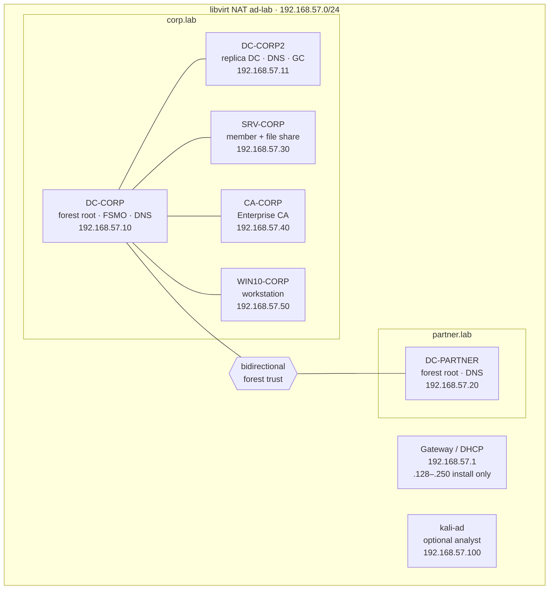

# active-directory-lab

Portable QEMU/KVM Active Directory lab for local study: two forests, replica DC, member server, dedicated Enterprise CA, Windows 10 workstation, optional Kali.

Isolated study network only. Do not bridge this lab onto a network you do not control.

This repo provisions **infrastructure**. It does not include attack procedures.

## Topology



| Guest | Hostname | Role | IP | RAM |
|-------|----------|------|-----|-----|
| dc-corp | DC-CORP | `corp.lab` forest root, FSMO, DNS | 192.168.57.10 | 4 GB |
| dc-corp2 | DC-CORP2 | replica DC, DNS, GC | 192.168.57.11 | 4 GB |
| dc-partner | DC-PARTNER | `partner.lab` forest root, DNS | 192.168.57.20 | 4 GB |
| srv-corp | SRV-CORP | member + `\\SRV-CORP\Share` | 192.168.57.30 | 4 GB |
| ca-corp | CA-CORP | Enterprise CA (not a DC) | 192.168.57.40 | 8 GB |
| win10-corp | WIN10-CORP | workstation | 192.168.57.50 | 4 GB |
| kali-ad | kali | optional analyst VM | 192.168.57.100 | 4 GB |

Network: libvirt NAT `ad-lab`, `192.168.57.0/24`, gateway `192.168.57.1`. DHCP is **192.168.57.128–250** (install/activation only). After setup, give each Windows guest its **static** IP from the table, gateway `.1`, then DC DNS.

Domains are `corp.lab` / `partner.lab` so this never collides with OffSec `corp.com`.

## Host prerequisites

- `qemu-kvm`, `libvirt`, `virt-install`, `virt-manager`; your user in `libvirt` / `kvm`
- Windows Server **Standard**, **Desktop Experience** eval ISO. Do **not** use Hyper-V Server / SERVERHYPERCORE
- Windows 10 ISO
- Optional [virtio-win](https://fedorapeople.org/groups/virt/virtio-win/direct-downloads/stable-virtio/) ISO (without it, guests use SATA + e1000)
- Optional Kali ISO
- Disks live under `/var/lib/libvirt/images/ad-kvm-lab` (never under `$HOME`). `create-disks.sh` creates that directory with sudo if needed.

Copy config and lab passwords:

```bash
cp config.env.example config.env
cp creds.example creds
cp scripts/windows/00-creds.ps1.example scripts/windows/00-creds.ps1
# edit config.env ISO paths
```

## Host: network, disks, VMs

Disks are **thin qcow2** (`preallocation=off`, 60G virtual, almost no space until the guest writes). `ls -lh` can still show 60G; `du -h` is what is used on disk.

```bash
chmod +x scripts/host/*.sh
./scripts/host/create-network.sh
./scripts/host/create-disks.sh
./scripts/host/virt-install-guest.sh dc-corp
# then dc-corp2, dc-partner, srv-corp, ca-corp, win10-corp, kali-ad
```

Finish Windows setup in virt-manager. Load virtio drivers from the second CD — see [unattend/README.md](unattend/README.md). Hostname and IP must match the table. Local Administrator password must match `00-creds.ps1`.

Snapshot after each major role (`virsh snapshot-create-as <guest> baseline`).

Kerberos: keep Windows clocks within ~5 minutes of the DCs (host NTP/chrony).

## Guest: download scripts, then run them

On the **Linux hypervisor**:

```bash
chmod +x scripts/host/*.sh
./scripts/host/serve-windows-scripts.sh
```

On each **Windows VM** (elevated PowerShell; guest must reach `192.168.57.1`, DHCP is fine for this step):

```powershell
Set-ExecutionPolicy Bypass -Scope Process -Force
irm http://192.168.57.1:8080/00-download.ps1 | iex
```

That writes everything to `C:\Lab`. Then set **this guest’s** hostname and static IP (`-Role` must match the VM, not always `DC-CORP`):

```powershell
cd C:\Lab
.\00-bootstrap.ps1 -Role DC-CORP      # first DC only
.\00-bootstrap.ps1 -Role DC-CORP2
.\00-bootstrap.ps1 -Role DC-PARTNER
.\00-bootstrap.ps1 -Role SRV-CORP
.\00-bootstrap.ps1 -Role CA-CORP
.\00-bootstrap.ps1 -Role WIN10-CORP
```

Valid roles: `DC-CORP`, `DC-CORP2`, `DC-PARTNER`, `SRV-CORP`, `CA-CORP`, `WIN10-CORP`. After reboot, run only the numbered script for **that** host. Defaults live in `00-lab-config.ps1` (optional override: `00-creds.ps1`). Numbered scripts refuse to run on the wrong hostname.

1. **DC-CORP:** `.\01-promote-forest-corp.ps1` # Check `dcdiag` is clean enough for a lab.
2. **DC-CORP2:** `.\02-promote-replica-corp.ps1` (joins, reboots, run again to promote) then `.\02b-verify-replication.ps1`
3. **DC-PARTNER:** `.\03-promote-forest-partner.ps1`
4. **Forest trust + DNS forwarders** (two VMs, two scripts — do **not** run `04` on both):
   - **On DC-CORP only:** `.\04-dns-forwarders-and-trust.ps1`  
     Adds a forwarder for `partner.lab` → `192.168.57.20` and creates the bidirectional forest trust.
   - **On DC-PARTNER only:** `.\04b-partner-forwarder.ps1`  
     Adds a forwarder for `corp.lab` → `192.168.57.10` / `.11`.  
     Verify on either DC: `nltest /domain_trusts` and `nslookup dc-corp.corp.lab` from DC-PARTNER.
5. **DC-CORP:** `.\05-domain-objects-corp.ps1`
6. **DC-PARTNER:** `.\06-domain-objects-partner.ps1`
7. **SRV-CORP:** `.\10-join-domain.ps1` then `.\07-member-share.ps1`
8. **CA-CORP:** `.\10-join-domain.ps1` then log on as **`CORP\Administrator`** (not local `Administrator`) and run `.\08-install-adcs.ps1`
9. **WIN10-CORP:** `.\10-join-domain.ps1` then `.\09-win10-local-admin.ps1`
10. **Kali:** static `.100`, DNS `.10` and `.11`

Microsoft: [AD DS](https://learn.microsoft.com/windows-server/identity/ad-ds/deploy/install-active-directory-domain-services--level-100-), [replica DC](https://learn.microsoft.com/windows-server/identity/ad-ds/deploy/install-a-replica-windows-server-2012-domain-controller-in-an-existing-domain--level-200-), [AD CS](https://learn.microsoft.com/windows-server/identity/ad-cs/active-directory-certificate-services-overview), [conditional forwarders](https://learn.microsoft.com/windows-server/networking/dns/deploy/create-a-conditional-forwarder).

## Lab directory objects

- OUs: `CorpUsers`, `CorpGroups`, `CorpServers`, `CorpWorkstations`
- Nested groups: `CorpStaff` → `ITStaff` → `Helpdesk`
- Users: `jdoe`, `hadmin`, `svc_web` (SPN `HTTP/srv-corp.corp.lab`)
- Share: `\\SRV-CORP\Share`
- `CORP\jdoe` in local Administrators on WIN10-CORP
- partner.lab: `puser`, `padmin` (padmin in Domain Admins)

Passwords are in `creds.example` (weak, lab-only).

## Layout

```
.
  README.md
  inventory.yaml
  creds.example
  config.env.example
  network/ad-lab.xml
  scripts/host/
  scripts/windows/
  unattend/README.md
```
